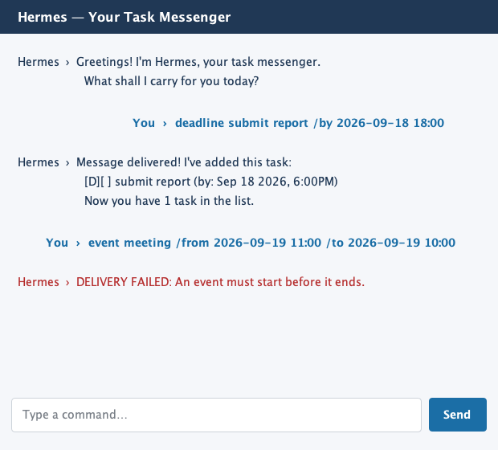

# Hermes User Guide

Hermes is a desktop task messenger that helps you capture todos, deadlines,
events, and reminders without leaving the keyboard.



## Getting started

1. Place `hermes-mini.jar` in a folder where Hermes may create its `data`
   directory.
2. Run `java -jar "hermes-mini.jar"` using Java 25 or newer.
3. Enter a command in the message box and press **Enter** or **Send**.

Dates and times use the format `yyyy-MM-dd HH:mm`, for example
`2026-09-18 18:00`. Hermes saves tasks automatically in
`data/hermes.txt`, relative to the JAR file's working directory.

## Commands

### Add a todo

```text
todo DESCRIPTION
```

Example: `todo read chapter 3`

### Add a deadline

```text
deadline DESCRIPTION /by DATE_TIME
```

Example: `deadline submit report /by 2026-09-18 18:00`

### Add an event

```text
event DESCRIPTION /from START_DATE_TIME /to END_DATE_TIME
```

Example:
`event project meeting /from 2026-09-19 10:00 /to 2026-09-19 11:00`

The start time must be earlier than the end time.

### Add a reminder

```text
remind DESCRIPTION /at DATE_TIME
```

Example: `remind call mum /at 2026-09-20 09:00`

### List tasks

Use `list` to display every saved task and its status.

### Find tasks

```text
find KEYWORD
```

The search is case-insensitive. Example: `find report`

### Mark or unmark a task

```text
mark TASK_NUMBER
unmark TASK_NUMBER
```

Task numbers are shown by `list`. Example: `mark 2`

### Delete a task

```text
delete TASK_NUMBER
```

Example: `delete 1`

### Exit

Use `bye` to end the conversation.

## Troubleshooting

- If Hermes highlights a message in red, read the message and correct the
  command format.
- Duplicate tasks are rejected to prevent accidental double entry.
- If the data file is missing, Hermes starts with an empty task list and
  creates the file when the first task is saved.
- If Hermes cannot read or write the data file, check that the folder is
  writable and that `data/hermes.txt` contains valid Hermes task records.

## Credits

Hermes was developed for the CS2103T individual project. No third-party UI
design or source code was reused for its interface.
